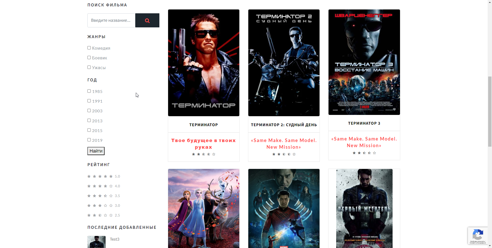

# Django Movies - Сайт Кинотеки  

--------------------------------------------------------




## 📄 Описание проекта

Проект представляет собой онлайн-базу фильмов с возможностью оставлять отзывы и оценки к ним. Пользователи могут искать фильмы по жанру, году выпуска, рейтингу. Также они могут оставлять отзывы и оценки к просмотренным фильмам, чтобы помочь другим пользователям сделать правильный выбор перед просмотром.

Регистрация на сайте сделана через библиотеку allauth. Так же подключена регистрация через VK (ВКонтакте).

На сайте доступна смена основного языка через библиотеку django-modeltranslation.

--------------------------------------------------------


## 🔧 Инструменты разработки:


[](https://www.python.org)
[](https://www.djangoproject.com)


### Технологический стек (Backend):
- Python - 3.7
- Django - 3.2
- Django-modeltranslation (gettext)


-----------------------------------------------------------

### Наполнение .env-файла

Должен находиться в djangoProject1
```dotenv
SECRET_KEY="your-secret-key"
DB_ENGINE=django.db.backends.sqlite3
ALLOWED_HOSTS=localhost,127.0.0.1,your-server-example.com
```

